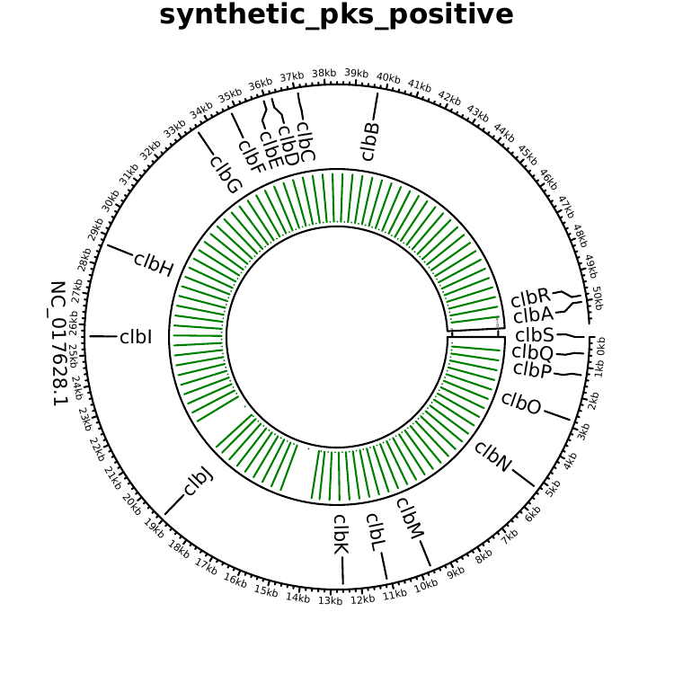

# pksProfiler

[](LICENSE)

**pksProfiler** is a Nextflow pipeline for detecting, quantifying, and visualizing the *pks* (polyketide synthase) pathogenicity island in BAM or paired-end FASTQ data. It reports counts for each of the 19 *clbA–clbS* genes and can optionally identify species supported by *pks*-aligned reads and summarize their *clb* gene support.

## How it works


The workflow has five modules:

1. **Read preparation** extracts primary unmapped reads from BAM input or accepts paired FASTQ input, then filters the reads with fastp.
2. **Host depletion** removes reads matching the supplied GRCh38 and T2T/phiX Minimap2 indexes.
3. **pks profiling** quantifies the island with Bowtie2 alignment by default. DNA HMM profiling can be selected instead or run alongside alignment.
4. **Summarization** produces 19-gene count matrices and a circular island-coverage plot for samples with aligned *pks* reads.
5. **Optional taxonomy** runs KrakenUniq and Bracken on *pks*-aligned reads and reports species-by-*clb*-gene support.

Alignment and HMM profiling are complementary and are not expected to produce identical counts. Alignment provides stringent reference-based evidence; HMM profiling can recover more divergent or fragmented matches.

## Installation

### 1. Install the requirements

- Linux
- [Nextflow](https://www.nextflow.io/docs/latest/install.html) 24.10 or newer
- Java 17 or newer
- Conda or Mamba
- Git

The remaining bioinformatics tools are installed from the environment files in [`conda_envs/`](conda_envs).

### 2. Clone pksProfiler

```bash
git clone https://github.com/ammalabbasi/pksProfiler.git
cd pksProfiler

nextflow -version
nextflow lint main.nf
```

### 3. Download the host-depletion indexes

Download these two files from the [pksProfiler reference-index folder on Google Drive](https://drive.google.com/drive/folders/10np5NSeAPRpHz1a22drGybs4enTP-OdR?usp=share_link):

- `human-GRC-db.mmi`
- `human-GCA-phix-db.mmi`

Place them together in a permanent directory that is readable from every compute node. For example:

```text
/references/pksProfiler/
├── human-GRC-db.mmi
└── human-GCA-phix-db.mmi
```

The *pks*-positive *E. coli* Bowtie2 index, *clbA–clbS* annotation, and DNA HMM database are already included in this repository.

### 4. Optional: install the taxonomy database

This step is needed only when running the [taxonomy mode](docs/running/taxonomy.md). The pipeline was validated with the 8 August 2023 KrakenUniq Microbial database.

```bash
mkdir -p /references/krakenuniq_2023
cd /references/krakenuniq_2023

wget https://genome-idx.s3.amazonaws.com/kraken/uniq/krakendb-2023-08-08-MICROBIAL/database.kdb
wget https://genome-idx.s3.amazonaws.com/kraken/uniq/krakendb-2023-08-08-MICROBIAL/kuniq_microbialdb_minus_kdb.20230808.tgz
tar -xzf kuniq_microbialdb_minus_kdb.20230808.tgz
```

This database is very large: `database.kdb` alone is approximately 535 GB. Download both files into the same directory. The [AWS KrakenUniq index page](https://benlangmead.github.io/aws-indexes/k2/#krakenuniq) lists other compatible collections.

## Running pksProfiler

### Quick start

Create a BAM sample sheet named `samples.csv`:

```csv
patient,bam
sample1,/absolute/path/to/sample1.bam
```

Run the default alignment workflow:

```bash
nextflow run main.nf \
    -profile conda \
    --sample samples.csv \
    --input_data_type bam \
    --hg38_db /references/pksProfiler/human-GRC-db.mmi \
    --t2t_phix_db /references/pksProfiler/human-GCA-phix-db.mmi \
    --outdir results
```

Bowtie2 alignment is the default, so `--profiling_method bowtie2` does not need to be written.

### Parameters

| Parameter | Values/default | Required | Description |
|---|---|---:|---|
| `--sample` | CSV path | Yes | BAM or FASTQ sample sheet |
| `--input_data_type` | `bam` (default), `fastq` | No | Selects the sample-sheet format |
| `--profiling_method` | `bowtie2` (default), `hmm`, `both` | No | Profiling method(s) to run |
| `--hg38_db` | `.mmi` path | Yes | GRCh38 Minimap2 index |
| `--t2t_phix_db` | `.mmi` path | Yes | T2T/phiX Minimap2 index |
| `--outdir` | `results` | No | Output directory |
| `--hmm_evalue` | `1e-10` | No | Positive HMM E-value threshold |
| `--hmm_chunking` | `false` | No | Parallelize HMM scanning across chunks |
| `--pks_taxa` | off | No | Enable taxonomy by including this flag |
| `--kraken_db` | directory | With taxonomy | KrakenUniq/Bracken database directory |
| `--bracken_read_length` | positive integer | With taxonomy | Read length supported by the Bracken database |

The input sample sheet must contain `patient,bam` for BAM mode or `patient,fastq1,fastq2` for paired FASTQ mode. Sample identifiers must be unique and may contain letters, numbers, periods, underscores, and hyphens; the first character must be alphanumeric. File paths should be absolute when running on a cluster.

### Choose a run mode

Open only the guide that matches your data and analysis:

| I want to... | Guide |
|---|---|
| Run alignment profiling from BAM files | [BAM mode](docs/running/bam.md) |
| Run alignment profiling from paired FASTQ files | [FASTQ mode](docs/running/fastq.md) |
| Run HMM profiling alone or together with alignment | [HMM and combined modes](docs/running/hmm.md) |
| Identify taxa associated with *pks*-aligned reads | [Taxonomy mode](docs/running/taxonomy.md) |
| Run on TSCC, Slurm, Biowulf, PBS Pro, LSF, or SGE | [HPC guide](docs/hpc.md) |

Editable sample sheets are available in [`examples/sample_sheets/`](examples/sample_sheets).

## Example results

The repository includes small positive and negative output examples:

| Sample | Alignment counts | HMM counts |
|---|---|---|
| Synthetic positive | [view table](examples/results/synthetic_positive/pks.gene.counts.align.txt) | [view table](examples/results/synthetic_positive/pks.gene.counts.hmm.txt) |
| Synthetic negative | [view table](examples/results/synthetic_negative/pks.gene.counts.align.txt) | [view table](examples/results/synthetic_negative/pks.gene.counts.hmm.txt) |

Each table contains one row for every gene from `clbA` through `clbS`. A valid negative sample remains in the matrix with zero counts.

```text
Gene    synthetic_pks_positive
clbA    1
clbB    38
clbC    10
...     ...
clbS    2
```

### Example coverage plot



[Download the example PDF](examples/plots/synthetic_positive/synthetic_pks_positive.pks.circos.pdf). A negative sample has zero counts but does not produce an empty coverage PDF.

## Main output folders

```text
results/
├── unmapped_reads/
├── host_depleted_reads/
├── pks_per_sample/
└── pks_summary/
    ├── gene_counts/
    ├── coverage_plots/
    └── taxonomy/          # only when taxonomy is selected
```

See the relevant [run-mode guide](#choose-a-run-mode) for the files produced by that mode.

## License

This project is distributed under the [BSD 2-Clause License](LICENSE).

## Citation

A manuscript citation will be added when available.
