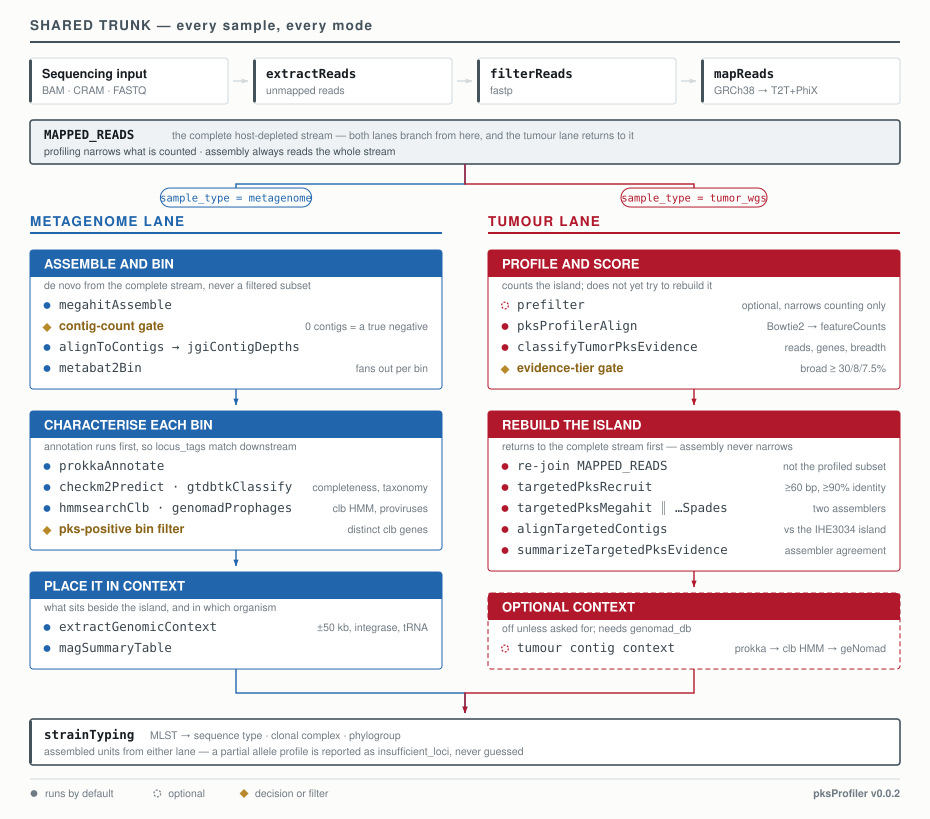

# pksProfiler

[](https://github.com/AlexandrovLab/pksProfiler/actions/workflows/ci.yml)
[](CHANGELOG.md)
[](https://www.nextflow.io/)
[](LICENSE)

**pksProfiler** is a Nextflow pipeline that detects and quantifies the *pks* island in sequencing
data, and identifies which bacterium is carrying it.

The *pks* island is a cluster of 19 genes (*clbA*–*clbS*) found in some gut bacteria, most often
*Escherichia coli*. Together they produce **colibactin**, a molecule that damages human DNA and
leaves a distinctive mutational signature in colorectal tumours.

Input is BAM, CRAM or FASTQ, from either a tumour genome or a metagenome. Every run answers the
first two questions below; the rest depend on your data and which stages you switch on.



<sub>The trunk runs for every sample. `MAPPED_READS` is the complete host-depleted stream and
the point both lanes branch from — note that the tumour lane returns to it before assembly, so
the profiling prefilter narrows what is *counted* and never what is *assembled*. Amber boxes are
decisions; dashed outlines are optional or conditional.</sub>

## The questions it answers

| Question | Data you need | You get | Switch it on with |
|---|---|---|---|
| **Is the island there, and how much of it?** | any | per-gene read counts, island coverage, a coverage plot | nothing — always runs |
| **How strong is that evidence?** | tumour or metagenome | an [evidence tier](#how-strong-is-the-evidence) per sample | nothing — always runs |
| **Does the island reassemble from its own reads?** | tumour | two independent assemblies, and whether they agree | `--sample_type tumor_wgs` |
| **Which organism is carrying it?** | metagenome | draft genomes, completeness, species | `--enable_mags true` |
| **Could the island move between bacteria?** | metagenome | whether an integrase or a tRNA site sits within 50 kb of the island — the features that let DNA transfer, which is a hint and not proof that it did | `--enable_mags true`; needs `--genomad_db` |
| **What is around the carrier?** | metagenome | prophages, and the DNA-damage-response genes in every neighbouring organism | automatic with `--enable_mags` |
| **What strain is the carrier?** | assembled output | sequence type, clonal complex, phylogroup | automatic |
| **What else is in the sample?** | any | species abundances | `--pks_taxa true` |

Flags, extra databases and the caveats for each are in the [documentation](#documentation).

## What can each sample type actually answer?

The table above says which flag turns a capability on. This says what to go look at once it has
run — real questions, which sample type answers them, and where the answer lives. None of it is
recomputed for display: everything below is read straight from files the pipeline already wrote.

**Is the island present, and how confident is the call?** — tumour and metagenome. Every sample
gets a [read-level evidence tier](#how-strong-is-the-evidence) — `by_sample/<sample>/read_evidence.tsv`,
and the tier badge plus reads/genes/breadth columns in `cohort/pks_cohort_report.html`. For a
metagenome the same tier is shown but isn't used to decide which draft genomes get investigated:
it was fitted on tumour breadth distributions, not metagenome depth, and every bin still gets its
own alignment-confirmed check regardless of it (below).

**Which specific contigs or genomes support that call?** — tumour: two independent reassemblies of
the recruited reads (MEGAHIT, metaSPAdes), each scored for reference coverage and supporting
contigs, plus a structural call and an assembler-agreement verdict (`concordant` / `discordant` /
`single_assembler_only` / `no_contig_support`) — `contigs/final_evidence/final_pks_evidence.tsv`,
the `contig_validation.svg` figure, and the Contigs / Island recovered / Assemblers columns of the
cohort report. Metagenome: every recovered genome bin gets its own alignment-confirmed locus tier,
independent of raw HMM domain hits — `genomes/pks_mag_summary.tsv` and the report's "Genome bins"
panel (taxonomy, completeness, locus tier, locus breadth).

**Why did I get nothing for this sample?** — tumour: `contigs/recruitment/` and the Contigs
column's hover text show how many reads were actually recruited and paired before assembly ran, so
"no reads reached the assembler" reads differently from "reads went in, no contig came out."
Metagenome: `genomes/mag_status.tsv` distinguishes no contigs / contigs but no bins / bins but no
pks signal / a positive bin — and even a sample with no real bins still gets an alignment check
against MetaBAT2's pooled unbinned contigs, which shows up in the same "Genome bins" panel as a
bin named `unbinned`.

**What else in this sample, or across the cohort, has clb-gene homology?** — metagenome only.
Reads the fast classifier missed but a sensitive DIAMOND rescue caught, by organism and which clb
gene, are in `prefilter/diamond_rescue_taxonomy.tsv` and the report's "Community clb homology"
panel. With `--pks_taxa`, `cohort/taxonomy/pks.clb_species_support.tsv` lists every species across
the whole cohort with direct read support for a clb gene, as its own table at the bottom of the
cohort report.

**Does the carrier sit near anything that could move the island, or wake a neighbour's
prophage?** — metagenome only. A one-line prophage-association call per bin (yes/no, region count)
is in the "Genome bins" panel; the full picture — nearby integrase/tRNA sites, and every
neighbour's own prophage load and DNA-damage-response genes — is in
`community/pks_island_mobility.tsv` and `community/pks_community_interactions.tsv`
([details](docs/running/community_context.md)).

**What strain is it?** — metagenome only, and only for recovered genome bins; the cohort report
doesn't read this lane. Sequence type, clonal complex and phylogroup are in
`by_sample/<sample>/strain/` and the typing columns of `cohort/pks.master_summary.tsv`. Fragmented,
low-coverage assemblies routinely come back `insufficient_loci` rather than a guessed type — see
[How strong is the evidence?](#how-strong-is-the-evidence).

Full column-by-column detail for every file above is in the [output reference](docs/output.md).

## Quick start

Needs Linux, [Nextflow](https://www.nextflow.io/docs/latest/install.html) ≥ 24.10 (enforced),
**Java 17+ on every node that runs a task**, and Conda or Mamba. There is no container support:
no process declares an image, so `-profile singularity` and friends are deliberately absent
rather than present-and-broken.

```bash
nextflow run AlexandrovLab/pksProfiler --help
```

A sample sheet is a unique `patient` column plus your files. `fastq1`/`fastq2` and
`cram`/`cram_reference` work the same way, and one sheet may mix them:

```csv
patient,bam
TUMOR_01,/data/TUMOR_01.bam
```

The minimum run — quantify the island and score the evidence:

```bash
nextflow run main.nf -profile local \
  --sample       samples.csv \
  --input_data_type bam \
  --sample_type  tumor_wgs \
  --hg38_db      /refs/human-GRC-db.mmi \
  --t2t_phix_db  /refs/human-GCA-phix-db.mmi \
  --outdir       results
```

Only `--hg38_db` and `--t2t_phix_db` are ever required; each optional stage needs its own
database, listed in its guide. On a cluster, swap `-profile local` for your scheduler (`conf/`
has TSCC, Biowulf, Slurm, PBS Pro, LSF and SGE) and add `-resume`. Start reading at
`results/cohort/qc/pks.qc.summary.tsv`, which shows where each sample lost its reads.

## Adding capabilities

Each row adds flags to the command above. Nothing is replaced.

| To also get | Add | Details |
|---|---|---|
| island reassembly, two assemblers | `--sample_type tumor_wgs` | [assembly](docs/running/assembly.md) |
| which organism carries it | `--sample_type metagenome --enable_mags true` plus `--gtdbtk_db --checkm2_db --genomad_db` | [MAGs](docs/running/mags.md) |
| community and neighbour context | automatic with `--enable_mags` | [community context](docs/running/community_context.md) |
| strain type and phylogroup | automatic; disable with `--enable_strain_typing false` | [strain typing](docs/running/strain_typing.md) |
| species abundances | `--pks_taxa true` or `--pks_community_taxa true`, plus `--kraken_db --bracken_read_length` | [taxonomy](docs/running/taxonomy.md) |
| profile-model search instead of alignment | `--profiling_method hmm` or `both` | [HMM modes](docs/running/hmm.md) |
| faster profiling on metagenomes | `--prefilter_mode balanced --kraken_db <dir>` | [prefilter](docs/prefilter.md) |

## Databases

Only the first two are ever required. Every run checks each one before submitting a single
task, and reports everything wrong with them in one pass rather than failing on the first.

| Flag | Needed for |
|---|---|
| `--hg38_db`, `--t2t_phix_db` | removing human reads — every run |
| `--pangenome_db` | optional extra human-read removal pass |
| `--kraken_db` | species abundances, and the optional prefilter |
| `--genomad_db` | prophage detection |
| `--gtdbtk_db`, `--checkm2_db` | naming and quality-scoring draft genomes |

## How strong is the evidence?

Read-level evidence is a tier, not a yes/no call. All three criteria must hold, and a sample gets
the highest tier it satisfies.

| Tier | *clb* reads | *clb* genes | Island breadth at ≥1× | Reassembled by default? |
|---|---:|---:|---:|:--:|
| `extensive_island` | ≥100 | ≥10 | ≥15% | yes |
| `broad_island` | ≥30 | ≥8 | ≥7.5% | yes |
| `multi_gene` | ≥5 | ≥3 | ≥1% | no |
| `localized_indeterminate` | ≥1, but fails one of the above | | | no |
| `negative` | 0 | — | — | no |

*Breadth* is the fraction of the island's 50,767 bp covered by at least one read. Every threshold
is a parameter, e.g. `--tumor_broad_island_min_pks_reads 50`.

> **These tiers rank how strong the evidence is. They are not a validated positive/negative test.**
> They were fitted on cohorts where every sample already carried at least one *pks* read, so what
> they measure is how well designated positives are retained — not where true positive stops and
> background mapping begins. A small nonzero breadth is **indeterminate**, not positive. No tier
> here is a clinical result.
>
> The one specificity result we have: across **420 matched TCGA tumour/normal pairs**, 0 of 420
> normals were positive at breadth ≥ 0.05 and above. That bounds the false-positive rate in
> matched normal tissue; it does not validate the boundaries, which sit well above it.
>
> 15% and 7.5% are v0.0.1's 20% and 10% converted for a change of measurement axis, not a
> recalibration — see [`CHANGELOG.md`](CHANGELOG.md).

Strain typing carries a similar limit. MLST reports a type only from exact allele calls, and a
partial profile is reported as `insufficient_loci` rather than guessed at. On fragmented,
low-coverage tumour contigs that is the usual outcome: no tumour-derived assembly in the v0.0.2
test set was typeable.

## Output

```text
results/
├── RUN_REPORT.txt          what produced this tree: commit, parameters, databases, versions
├── by_sample/<sample>/     everything this one sample produced
│   ├── read_evidence.tsv   evidence tier, reads, genes, breadth
│   ├── counts.txt          reads per clb gene
│   ├── alignment/          bam, coverage, per-sample QC
│   ├── contigs/            recruitment, both assemblies, final evidence
│   ├── genomes/            draft genomes, completeness, species, annotation
│   ├── community/          prophages, flanking genes, producer-neighbour tables
│   ├── strain/             sequence type, clonal complex, phylogroup
│   └── figures/            coverage plot, taxa barplots, contig validation
├── cohort/                 gene counts, QC summary, taxonomy, master summary, cohort report
└── runs/                   Nextflow report, timeline, trace, and every run's record
```

The sample directory is the unit: if it is not under `by_sample/<sample>/`, it is not about that
sample. Both sample types write the same paths — `--sample_type` decides which directories exist,
not where they sit. A sample with no *pks* reads stays in every table as a row of zeros rather
than disappearing, so "tested and negative" is distinguishable from "never ran", and
`pks.qc.summary.tsv` carries a `status` column so a sample that failed mid-run is visible rather
than silently absent.

### One table with everything

Each stage writes its own results, which is awkward to read across. `cohort/pks.master_summary.tsv`
joins them into one row per sample — whatever ran, with `NA` where a stage did not — and is written
automatically at the end of every run. You can also run it by hand against a finished (or partly
finished) results directory, since it only reads published output:

```bash
python3 scripts/build_master_summary.py --results results \
  --output results/cohort/pks.master_summary.tsv
```

The width of the table tells you what the run did: with everything enabled you get read counts,
the evidence tier and breadth, the structural call from reassembly, the *pks*-positive genome's
species and completeness, prophage and neighbour counts, island mobility flags, and the sequence
type and phylogroup — about 30 columns.

### What the output looks like, and what it answers

Every example below is synthetic data committed to the repository, so you can open it before
running anything. These are the four files worth knowing about; the rest are in the
[output reference](docs/output.md).

**Is the island there, and how much of it?** — `cohort/gene_counts/pks.gene.counts.align.txt`,
one row per *clb* gene and one column per sample. A sample with none is a column of nineteen
zeros, not a missing column, so a negative is a result rather than an absence.

| | Alignment counts | HMM counts |
|---|---|---|
| Synthetic positive | [table](examples/results/synthetic_positive/pks.gene.counts.align.txt) | [table](examples/results/synthetic_positive/pks.gene.counts.hmm.txt) |
| Synthetic negative | [table](examples/results/synthetic_negative/pks.gene.counts.align.txt) | [table](examples/results/synthetic_negative/pks.gene.counts.hmm.txt) |

Run both methods with `--profiling_method both` and the two appear side by side, never merged
— they answer the same question by different means and are worth disagreeing in the open.

**Did this sample really have nothing, or did it lose its reads on the way?** —
`cohort/qc/pks.qc.summary.tsv`, one row per sample whether or not it had reads. Read it left to
right and the answer is in the drop:

| Sample | input_alignment_records | extracted_unmapped_reads | reads_after_fastp | reads_after_hg38 | reads_after_t2t_phix | num_clb_genes_align | reads_clb_genes_align | taxonomy_status | status |
|---|---:|---:|---:|---:|---:|---:|---:|---|---|
| SYNTHETIC_01 | 921,440,112 | 14,882,301 | 14,701,118 | 612,447 | 318,902 | 14 | 412 | species_identified | complete |
| SYNTHETIC_04 | 870,552,901 | 12,904,663 | 12,781,220 | 533,907 | 262,884 | 8 | 37 | below_rank_threshold | complete |
| SYNTHETIC_08 | 889,447,002 | 13,774,552 | 13,640,775 | 570,119 | 280,447 | 0 | 0 | no_pks_reads | complete |

[Full example, all 17 columns](examples/results/cohort_report/pks.qc.summary.tsv).
`input_alignment_records` is the library, not the already-extracted subset, so the first drop
is measurable rather than assumed. `status` separates a partial run from a complete one, and
`taxonomy_status` says why a sample is not in the species table instead of leaving it absent.

**Which samples in this cohort are worth looking at?** —
`cohort/pks_cohort_report.html`, one page across every sample: evidence tier, reads, genes,
island breadth, and the assembly call where there is one. It arranges the pipeline's own
outputs and derives nothing, so it cannot disagree with the run it describes. Plain HTML with
no JavaScript, so it also renders inside a sandboxed viewer such as JupyterLab.

[**▶ Open the example cohort report**](https://htmlpreview.github.io/?https://github.com/AlexandrovLab/pksProfiler/blob/main/examples/results/cohort_report/pks_cohort_report.html)
 · [source](examples/results/cohort_report/pks_cohort_report.html) · [same data as TSV](examples/results/cohort_report/pks_cohort_report.tsv)

**What produced these numbers?** — `RUN_REPORT.txt`, at the top of the results tree: the
commit, the flags actually typed, which stages were enabled, digests of every reference and
database, tool versions as conda installed them, which tasks ran, cached or failed with a path
to each failure's log, and checksums of the cohort tables. Every run keeps its own copy under
`runs/reports/`, so a `-resume`d tree carries the history of all the runs that built it.

## Running on HPC

Swap `-profile local` for your scheduler and add `-resume` so an interrupted run continues rather
than restarting. Profiles for TSCC, Biowulf, Slurm, PBS Pro, LSF and SGE are in [`conf/`](conf).

Two things that catch people out: **Java 17+ must be present on the compute nodes**, not just the
login node, and concurrent runs each need their own launch directory or they will collide on
Nextflow's session lock. Resource requests are sized from a measured 2,000-sample run rather than
guessed, and every request keeps a `* task.attempt` multiplier so a task that genuinely needs more
gets it on retry. See the [HPC guide](docs/hpc.md).

## Documentation

| Guide | |
|---|---|
| [BAM and CRAM mode](docs/running/bam.md) · [FASTQ mode](docs/running/fastq.md) | input modes |
| [HMM and combined modes](docs/running/hmm.md) | profile-model search, and how it differs from alignment |
| [Island reassembly](docs/running/assembly.md) | evidence tiers, targeted assembly, mobility context |
| [Genome-resolved analysis](docs/running/mags.md) | recovering draft genomes from a mixed sample |
| [Community context](docs/running/community_context.md) | prophages, island mobility, neighbouring organisms |
| [Strain typing](docs/running/strain_typing.md) | sequence type, clonal complex, phylogroup |
| [Taxonomy](docs/running/taxonomy.md) · [Read prefilter](docs/prefilter.md) | abundances; optional narrowing before profiling |
| [Output reference](docs/output.md) · [Glossary](docs/glossary.md) | what every file contains; terms |
| [HPC guide](docs/hpc.md) | schedulers, resources, known pitfalls |
| [Reference models](ref/hmm/PROVENANCE.md) | how the *clb* profile models were built, and what they are not calibrated for |
| [Tool citations](CITATIONS.md) | every tool the pipeline calls, with DOIs |

Tests run on every push: `bash tests/run_checks.sh` for the full set, or
`python3 -m unittest discover -s tests` for the fast checks that need no Nextflow.

## Citation

A manuscript is in preparation. Until then cite the software — GitHub and Zenodo both read
[`CITATION.cff`](CITATION.cff), so the "Cite this repository" button produces a correct
reference. Record the release tag or commit you ran, and cite the underlying tools your run used
([`CITATIONS.md`](CITATIONS.md)).

The biological premise — that colibactin-producing *E. coli* leave a distinctive mutational
signature in colorectal cancer — rests on Pleguezuelos-Manzano *et al.* and
Dziubańska-Kusibab *et al.*, both *Nature* 2020.

## License

[BSD 2-Clause](LICENSE).
